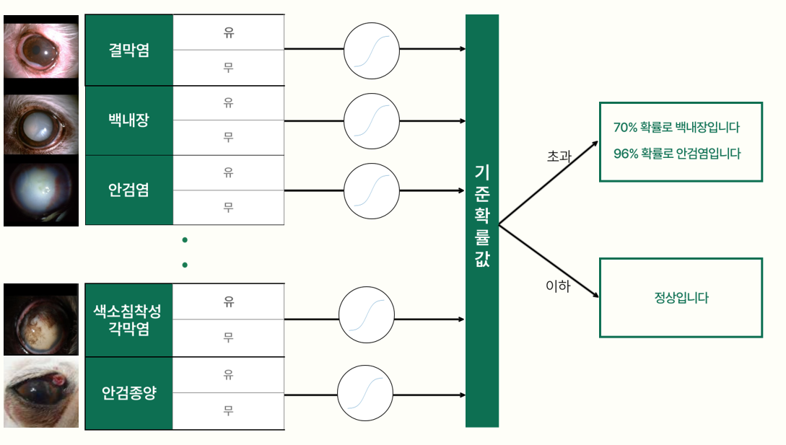
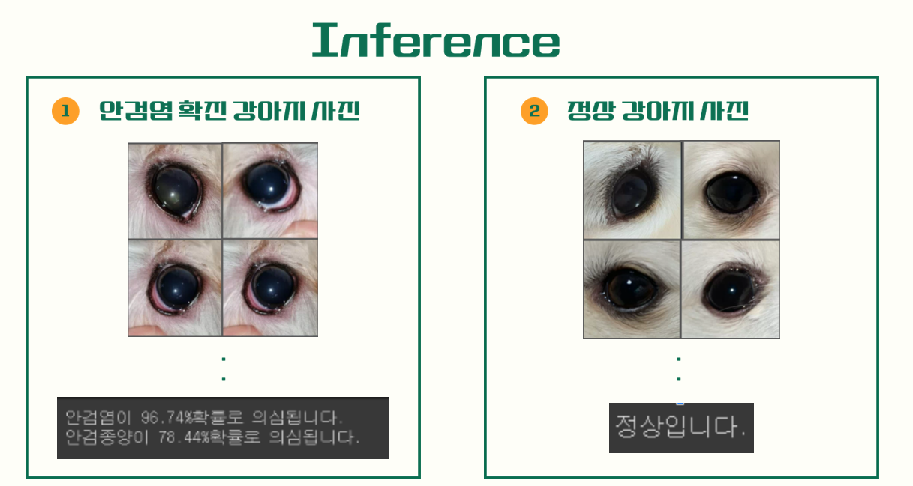

# 🐶반려견을 위한 안구 질병 판별기 🐶

## 👨🏿‍🤝‍👨🏿Member
[노아윤](https://github.com/ayun3738) | [라허운](https://github.com/RAHEOUN) |[박진성](https://github.com/jinseong1170)|[서상혁](https://github.com/sseo1124)
:-: | :-: | :-: | :-: 
|||

## 📋Index
- [📝 Project Summary](#📝project-summary)
- [👀 데이터셋 ](#👀-데이터셋 )
- [📆 Procedures](#📆-Procedures)
- [🔍 Conclusion](#🔍-Conclusion)
- [⚒️ Appendix](#⚒️-Appendix)

## 📝Project Summary
- 개요
  > 딥러닝을 통해 10여가지의 반려견 안구 질병의 유무를 판단하여 고객들에게 수시로 핸드폰으로 반려견의 상태를 확인할 수 있는 판별기
- 목적 및 배경
  > 국내 반려동물 가구는 30%를 차지할 정도로 비율이 증가하고 있음. 하지만 반려견과 서로 대화를 할 수 없기에 견주들은 아픈 상황을 눈치채기 어려움. 또한 전문적인 수의학 지식을 일반인이 보유하긴 어렵기 때문에 지속적인 관찰이 어려우며, 걱정이 될 때마다 매번 동물병원에 가기엔 경제적 비용이 많이 발생함.  

  -> 우리의 AI 모델을 사용한다면 100% 신뢰보다는 1차적으로 일반인분들에게 경고를 주거나 지나친 걱정에 대해 안심할 수 있을 거라고 기대함. 
  
- 모델 설계
  > 질병을 수시로 일반카메라로 확인하는 서비스에 목적성을 두므로 일반화된 이미지에 관해 정확한 multi-classification의 적용이 필요함.
- 기대효과
  > 데이터를 일반카메라, 검안경 데이터로 구성하여 학습하면 수의사의 진료 보조로써의 판별 모델이 추가적으로 가능할 것으로 기대함.
- 활용 장비 및 재료
  - 라이브러리 : tensorflow, OpenCV, sklearn 
  - 개발 및 협업 툴 : python, colab notebook, vscode(windows), tensorboard  

## 👀 데이터셋 

### AIhub 반려동물 안구질환 데이터
- 출처 : [AIhub 안구질환 데이터](https://aihub.or.kr/aihubdata/view.do?currMenu=100&aihubDataSe=realm&dataSetSn=562)
- 소개 : 국내 주요 반려동물 종류인 반려견과 반려묘에 대하여 내원율이 가장 높은 안구질환을 기준으로 반려견 안구질환 12종, 반려묘 6종에 대해서 수집. 일반카메라뿐만 아니라 검안경, 안구 초음파 사진 등 다양한 유형의 사진들을 질환별로 수집ㆍ구축한 데이터
- 라벨 : 
  1. AI허브의 폴더구성에 따르면 질병별로 증상유무를 폴더로 구분해 놓아 이를 토대로 질병 유무 라벨링을 진행
  2. : 라벨 json을 통해 일반카메라, 스마트폰, 검안경 안구 데이터만 선정
- 전체 이미지 개수 : 약 170,000장
- 10 class : 결막염 (conjunctivitis), 백내장 (Cataract), 안검염  (blepharitis), 비궤양성 각막염 (corneal), 궤양성 각막염 (corneal_ulcer), 안검 내반증 (Entropion), 유루증 (epiphora), 핵경화 (Nuclear_Sclerosis), 색소침착성 각막염 (PIH), 안검종양 (Xanthelasma)
- 이미지 크기 : (2304 x 1728) ~ (3264 x 2448) -> (224 x 224)

## 📆 Procedures

>**[2023.03.10 ~ 2023.3.14]**  
>- 프로젝트 주제 탐색 및 선정, 프로젝트 계획 구상

>- 여러 질병의 위험도를 각각 분석하기 위해 10개의 모델을 연결하는 pipeline을 구상
> 
>
>**[2023.03.15 ~ 2023.03.21]**
>- 데이터 수집 및 전처리  
>- 데이터의 사이즈가 중구난방으로 다름을 확인했고, 분류모델으로 ResNet Fine-Tuning을 생각하고 있었기 때문에 224x224로 resize
>- 10 class의 질병별 유무 라벨링, 분류모델로 이미지 데이터량이 충분하다고 판단하여 질병당 training data 20000image 이하로 제한
> 
>
>**[2023.03.22 ~ 2023.03.30]**
>- Train, valid dataset 8:2 split
>- Model training and testing
>- test한 결과 바탕으로 부실한 모델들 데이터 전처리를 수정하여 모델학습 재진행
>- 최종 모델의 test recall, f1_score 기준으로 sigmoid threshold를 결정 

## 🔍 Conclusion

### Inference

한장 또는 여러장의 강아지 눈사진을 이용자가 찍으면, 의심되는 질병을 알려준다.

### Conclusion & Extension
1. Classification에 대표적인 ResNet을 transfer learning하여 안구판별기 모델을 학습시켜 동작함을 확인했다.
-> 단순 classfication 뿐 아니라 AIhub 데이터에 detection labeling도 있었으므로 이후 강아지 사진에서 detection, 안구판별까지 한번에 가능하리라 예상됨.
2. 하드웨어적 한계로 이미지 크기를 224x224로 줄여서 학습시킬수 밖에 없었던 점이 아쉬웠다. -> 학습수준에서는 colab 노트북으로 프로젝트를 진행하였지만 추후 이미지 크기를 조정하면 더 정확한 판별기를 모델링할 수 있으리라 예상됨.

## ⚒️ Appendix

| Reference | Git | Paper |
| ---- | ---- | ---- |
| ResNet | Data Processing(Anomaly Box Data), Model testing (Yolo v7, v8), OCR Modeling, Model web serving, Making Presentation File | [ResNet](https://arxiv.org/abs/1512.03385)
